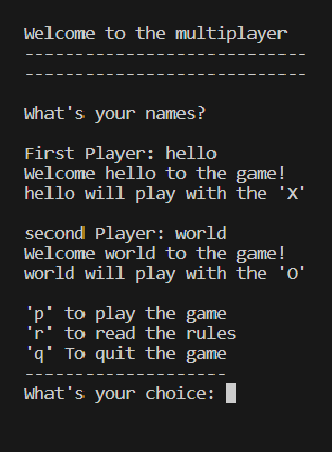
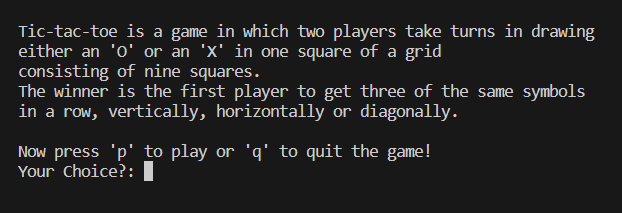
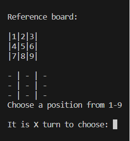
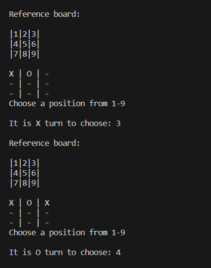
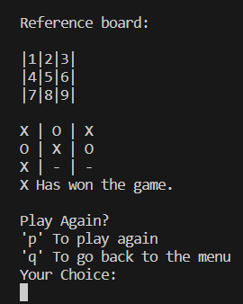
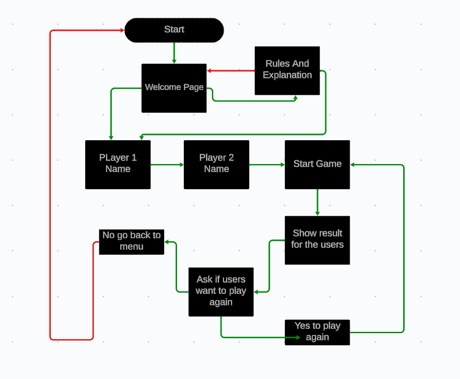
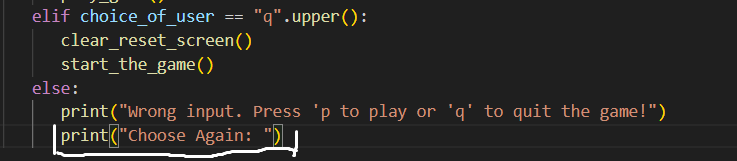
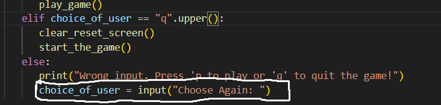
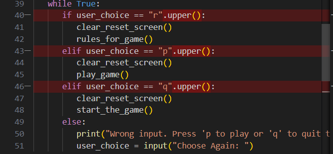
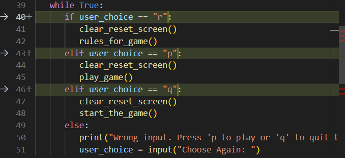

# Balen Nouri Tic-Tac-Toe Mulitplayer

Three in a row or tic tac toe, everyone has played this game, maybe in school with paper and pen or on a real board.  For those who don’t know about the game, it’s a classic old game with 3 x 3 boxes for two players. One will play with the X and the other one with the O and the one who gets three in a row will win. So, if you and your friend want to challenge each other and wake up old memories from the classic game, click on the link below.

[A live version of the website and the project can be accessed here:]()

## Table of Contents

- [Balen Nouri Tic-Tac-Toe Mulitplayer](#balen-nouri-tic-tac-toe-mulitplayer)
  - [Table of Contents](#table-of-contents)
  - [User Experience Design](#user-experience-design)
    - [User Demographic](#user-demographic)
    - [User stories](#user-stories)
  - [How To Play](#how-to-play)
  - [Features](#features)
    - [Game](#game)
    - [Future Feature](#future-feature)
  - [Data Model](#data-model)
  - [Flowchart](#flowchart)
  - [Languages Used](#languages-used)
  - [Technologies Used](#technologies-used)
  - [Libraries used](#libraries-used)
  - [Testing and Validation](#testing-and-validation)
    - [PEP8](#pep8)
    - [Manual testing](#manual-testing)
    - [Known Bugs](#known-bugs)
      - [Resolved](#resolved)
      - [Python Warnings and Bugs](#python-warnings-and-bugs)
    - [Unfixed Bugs](#unfixed-bugs)
  - [Deployment](#deployment)
    - [Heroku Deployment](#heroku-deployment)
  - [Credits](#credits)
    - [Content And Code](#content-and-code)
  - [Acknowledgements](#acknowledgements)

## User Experience Design

### User Demographic

This website is meant for:

- Users who want to play a game with a friend
- User who loves old games.
- User who wants to learn an easy game to play.

### User stories

As a user of this website:

- To play a game against a friend.
- Be able to read the rules and the meaning of the game.
- Be able to play again or quit the game when the game is finished.

## How To Play

## Features

- The game is easy to play and doesn’t need any special configurations.
- When the user comes into the game, they are welcomed and can choose between some options.
- If the user enters an invalid input, the user will get the chance to re-enter a command until it’s valid.

### Game

Screenshots from the game:

Rules for the game:

How the game board looks like:

When the game is done:

### Future Feature

Features to be added in the future:

- Be able to play single player.
- Be able to see scoreboard.
- Be able to choose an own sign instead of X or O.
- Put in some color to the game.

## Data Model

## Flowchart

A flowchart describing the logic behind this application has been created using [Lucidchart.](https://www.lucidchart.com/pages/landing?utm_source=google&utm_medium=cpc&utm_campaign=_chart_en_tier2_mixed_search_brand_exact_&km_CPC_CampaignId=1520850463&km_CPC_AdGroupID=57697288545&km_CPC_Keyword=lucidchart&km_CPC_MatchType=e&km_CPC_ExtensionID=&km_CPC_Network=g&km_CPC_AdPosition=&km_CPC_Creative=442433237648&km_CPC_TargetID=kwd-33511936169&km_CPC_Country=21003&km_CPC_Device=c&km_CPC_placement=&km_CPC_target=&gad_source=1&gclid=Cj0KCQiAhc-sBhCEARIsAOVwHuS-QAiBPSXj3yOMy75khyNm4_a4nkKCQMtc0JOHhSl6XZthZn-xZxoaAioqEALw_wcB) It served as a guideline when the actual game was coded.

## Languages Used

- Python

## Technologies Used

- Visual Studio Code to write the code and pushing to Github.
- Github was used to store and create the repository.
- Heroku was used to deploy the project.

## Libraries used

- Os to create a clear_reset_screen(), which clears the screens so there's not so much clutter on the page.

## Testing and Validation

### PEP8

### Manual testing

test on diffrent browsers

### Known Bugs

#### Resolved

During code validation and testing the game, these warnings were shown:

#### Python Warnings and Bugs

At the start of the game, when the user can choose between rules, quit or play, the game will give the message to the user that they used an invalid command. The problem was, when the message showed up it just kept coming more and more. Below you can see how I solved it.

- This is the code I used first that caused the bug.

- This is the code I used that worked and removed the bug.

This was causing error when the user pushed on any of the options, Below you can see how I solved it.

- The code i used, that didn't work.

- This is the code i used that worked.

### Unfixed Bugs

No unfixed bugs.

## Deployment

### Heroku Deployment

To deploy this page to Heroku from its GitHub repository the following steps were taken:

- Log into or register a new account at [Heroku](https://www.heroku.com/).
- Click on the button New in the top right corner of the dashboard.
- From the drop-down menu then select Create new app.
- Enter your app name in the first field, the names must be unique so check that the name you have chosen is available on Heroku, then select your region.
- Click on Create App.
- Set the buildbacks to python and NodeJS in that order.
- Link the Heroku app to the respository.
- Click on Deploy.

## Credits

### Content And Code

- The screenshot at the top of the ReadMe was built from [Ami Responsive.](https://ui.dev/amiresponsive)
- The information about the game in the readme is taken from [wikipedia.](https://sv.wikipedia.org/wiki/Tre_i_rad)
- The flowchart in readme was made by [Lucidchart.](https://www.lucidchart.com/pages/landing?utm_source=google&utm_medium=cpc&utm_campaign=_chart_en_tier2_mixed_search_brand_exact_&km_CPC_CampaignId=1520850463&km_CPC_AdGroupID=57697288545&km_CPC_Keyword=lucidchart&km_CPC_MatchType=e&km_CPC_ExtensionID=&km_CPC_Network=g&km_CPC_AdPosition=&km_CPC_Creative=442433237648&km_CPC_TargetID=kwd-33511936169&km_CPC_Country=21003&km_CPC_Device=c&km_CPC_placement=&km_CPC_target=&gad_source=1&gclid=Cj0KCQiAhc-sBhCEARIsAOVwHuS-QAiBPSXj3yOMy75khyNm4_a4nkKCQMtc0JOHhSl6XZthZn-xZxoaAioqEALw_wcB)
- The code for clear_reset_screen() function was taken from [Coding4you.](http://www.coding4you.at/inf_tag/beginners_python_cheat_sheet.pdf)

## Acknowledgements

This site was developed as my Third portfolio project for the Code Institute course in Full Stack Software Development. I would like to thank my mentor David Bowers, the slack community and the Code Institute team.

[Back to Table of contents](#balen-nouri-tic-tac-toe-for-2-players)
